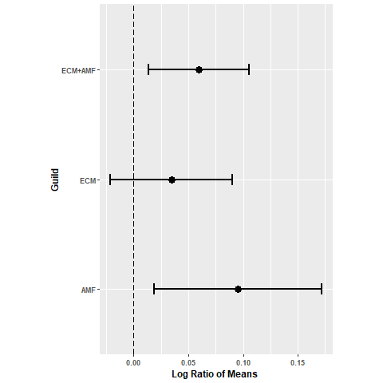
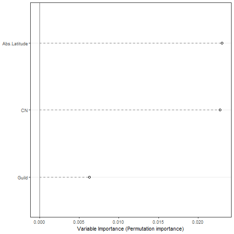
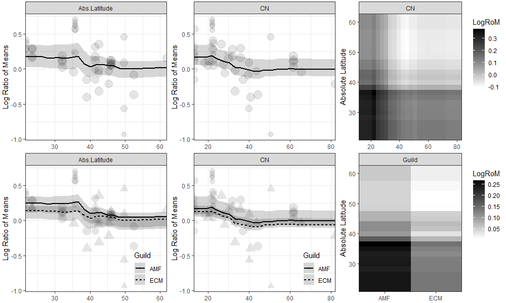

# Fungal inter-guild interactions and their effect on organic matter decomposition: a meta-analysis.

## Introduction

Soil microbial communities play a major role in the C and nutrients dynamics in terrestrial ecosystems  
since the way they obtain resources from organic matter (OM) regulates the process of OM decomposition  
(Chapin et al., 2011). These microorganisms are grouped into different "guilds" according to the way  
they consume resources (Talbot et al., 2015), including free-living saprobes (SAPs), ectomycorrhizal  
fungi (ECM) and arbuscular mycorrhizal fungi (AMF).  

SAPs include fungi and bacteria characterized by producing exoenzymes which allow them to obtain C  
(Alfaro et al., 2014). Consequently, SAPs are considered as the guild that most promotes OM decomposition.  
On the other hand, both ECM and AMF maintain a mutualistic association with the roots of different plant  
hosts. In this interaction, the mycorrhizal fungi acquire nutrients (e.g. N) present in OM, which are  
transferred to their host, who, in turn, translocates part of the C it fixes to their symbionts (Read and  
Pérez-Moreno, 2003).  

Both ECM and AMF acquire nutrients by two different processes that differentially impact OM decomposition.  
Particularly, ECM produce exoenzymes that degrade the matrix of C in the OM in search of the N contained  
in it (Talbot et al., 2008; Lindahl and Tunlid 2015; Talbot et al., 2015). Nevertheless, their capacity  
to decompose OM is lower compared to SAPs (Talbot et al., 2013). Contrastingly, AMF indirectly obtain  
surrounding nutrients resulting from the activity of other microbes, and without affecting decomposition,  
since they are not able to produce exoenzymes (Leigh et al. 2009).  
 

Since mycorrhizal fungi and SAPs obtain resources from the same substrates (e.g.  litter, soil or wood)  
an inter-guild interaction between them with the capacity to regulate OM decomposition is expected.  
Specifically, ECM reduce decomposition by limiting the activity of SAPs to the extent that they obtain N  
from the substrate, in a phenomenon known as the “Gadgil effect” (Gadgil and Gadgil, 1975; Fernández and  
Kennedy, 2016). On the other side, AMF promote OM decomposition by stimulating the activity of SAPs through  
exudation of labile C, in a phenomenon known as the “priming effect”, which allows them to access N that  
they cannot obtain enzymatically (Posada et al., 2012; Hodge et al., 2001; Leigh et al., 2009; Hodge and  
Fitter, 2010; Leifheit et al., 2015).  

Therefore, it has been suggested that ECM-dominated ecosystems store a greater C amount in the soil  
compared to AMF-dominated sites (Orwin et al., 2011). However, the influence of mycorrhizal fungi on  
OM decomposition is inconsistent, since the same mycorrhizal guild can promote negative, neutral or  
positive effects (Cheng et al. , 2012; Herman et al., 2012; Averill and Hawkes, 2016; Trap et al., 2017).  

The substrate chemical composition is a moderator that could regulate these inconsistencies and explain  
how inter-guild interactions influence decomposition. In this sense, those substrates with a low N  
concentration (high C:N ratio) are more likely to promote a priming effect with ECM involved (Fernández  
et al., 2020), while the substrates with a higher N concentration (low C:N ratio) could promote a primming  
effect with AMF involved.  

The previous patterns have been described from global data in ecosystems dominated by different mycorrhizal  
guilds (Averill, 2014). However, it has been scarcely evaluated whether they respond directly to an  
inter-guild interaction, or to the OM traits. Furthermore, since the inter-guild interaction influences the  
C storage in different ecosystems, it is important to know the effect that each mycorrhizal guild has on  
the OM decomposition, as well as the conditions that regulate this phenomenon. For this reason, in this  
work 36 articles that tested the effect of the inter-guild interaction on the OM decomposition were  
evaluated to test the following hypotheses:

1. The presence of ECM fungi decreases OM decomposition, while the presence of AMF promotes it.  
Consequently, there is a difference in the effect of both guilds on OM decomposition.  

2. C:N ratio is important affecting inter-guild interactions. At a higher substrate C:N ratio there is  
a greater inhibition of decomposition related to the presence of ECM, while at a lower C:N ratio there is  
a greater decomposition related to the presence of AMF.  

## Methods  

### Obtaining data  

Data were extracted from 36 articles (see the list at the end of the document) that evaluated the effect of  
ECM or AMF on the OM decomposition as a product of its interaction with SAPs. Said studies were carried out  
through experiments under field or laboratory conditions that, in general, consisted of restricting (control)  
or allowing (treatment) the presence of a mycorrhizal guild in an area where SAPs were decomposing different  
substrates.  

The mean decomposition, SD, and replicate numbers in the treatments and controls reported in each work were  
obtained in substrates such as litter, soil and wood. The decomposition measures were reported in terms of  
respiration, mass loss/remaining, decay rate or C remaining of the substrates in the treatments.  
 
In addition, the C:N ratios of the substrates (C:Ns) subject to decomposition were obtained, as well as other  
variables that could affect the evaluated process, including the air temperature, time, absolute latitude,  
biome, condition of the experiment (field/lab), and the unit of measurement of decomposition. In total 94  
studies (observations) were evaluated, of which 47 corresponded to ECM and 47 to AMF.  

### Statistical analysis  

#### Meta-analysis  

A Meta-analysis was conducted to evaluate the effect of mycorrhizal fungi on OM decomposition using the R  
package “metafor” (Viechtbauer, 2010). For each mycorrhizal group independently and in combination (ECM+AMF),  
the logarithm of the ratio of means (LogRoM) was calculated as the effect size with the function `escalc `,  
and based on means, SDs and replicate number for controls and treatments, as follows:  
 
_LogRoM= Log(Treatment/Control)_  

Where “Treatment” and “Control” represent the average of decomposition in the treatment and control of each  
study, respectively. Therefore, a value greater or less than 0 represents an increase or decrease in the  
substrate decomposition, respectively.  

To determine if each mycorrhizal guild had a significant effect on OM decomposition, a random effects model  
was applied using the function `rma`, which allowed to calculate 95% confidence intervals (CIs) for the mean  
effect size of each mycorrhizal guild. If the CIs of the LogRoM did not overlap with 0, then the responses  
were significant at p < 0.05. The Q test for heterogeneity  and the I2 statistic are reported as measures of  
the amount of heterogeneity between studies.  
 
In addition, the effect sizes among mycorrhizal guilds were compared using the function `rma.mv`. A plot  
comparing the effect sizes between each mycorrhizal guild and both of them (ECM+AMF) was created with  
“ggplot2”. The analysis and plot were created using R version 4.1.1. The data used are contained in the file  
“metaanalysis.csv” and the script is present in “metaanalysis_script.sh”.  

#### Metaforest  

An exploratory search for relevant moderators affecting decomposition resulting from inter-guild interaction  
was conducted using “MetaForest”. This is a machine-learning based approach to meta-analysis, using a random  
forests algorithm (Van Lissa 2017).  
  
A model was created with the effect size (obtained during the meta-analysis) as a function of the guild, C:N  
ratio, absolute latitude, air temperature, time, condition, unit of measure and biome. To filter irrelevant  
moderators, a 100-fold replicated feature selection was used, retaining only moderators with positive variable  
importance in > 50% of replications. 

The main model (LogRoM ~ Guild + Abs. Latitude and C:N) was obtained with an analysis consisting of 15,000  
regression trees with random-effect weights, one candidate variable per split, and a minimum of five cases  
per terminal node. The importance of the moderators in the main model  was plotted with the `VarImpPlot`  
function.  

Partial dependence plots showing the relation between each factor with the effect size based on the model,  
were obtained with the function `PartialDependence` and modified using “ggplot2” and “gridExtra”. The  
analysis was carried out using R version 4.1.1. The data used are contained in the file “metaforest.csv” and  
the script is present in “metaforest_script.sh”.  

## Results  

A total of 43 studies were included in the meta-analysis evaluating the effect of ECM on decomposition. The  
estimated average effect size based on the random-effects model was μ^=0.0345 (95% CI: −0.0211 to 0.0901).  
Therefore, the average outcome did not differ significantly from zero (p=0.2238) (figure 1). According to  
the Q-test, the effect size of the studies was heterogeneous (Q(42)=276.9212, p<0.0001, I2=90.47%). Hence,  
although the average effect size is estimated to be positive, in some studies it may in fact be negative.  
 
When evaluating the effect of AMF, a total of 38 studies were included. The estimated average effect size  
was μ^=0.0953 (95% CI: 0.0187 to 0.1720) and differed significantly from zero (p=0.0148), representing a 10%  
increase in decomposition promoted by AMF (figure 1). The Q-test indicated that the effect size among studies  
was heterogeneous (Q(37)=363.1514, p<0.0001, I2=95.9294%). On the other hand, there was no difference in the  
effect size promoted by AMF compared to ECM.  

A total of 81 studies were included in the meta-analysis evaluating the effect of both AMF and ECM on  
decomposition (ECM+AMF). The estimated average effect size of the studies was μ^=0.0597 (95% CI: 0.0139 to  
0.1056). Therefore, it differed significantly from zero (z=2.5560, p=0.0106) and represents a 6.2% increase  
in decomposition (figure 1). In addition, the Q-test showed heterogeneity between studies (Q(80)=652.6563,  
p<0.0001, I2=95.0390%).  

  

Figure 1. Effect of mycorrhizal guilds on decomposition by interacting with free-living saprobes.  

The metaforest showed that the absolute latitude, C:N ratio and mycorrhizal guild were the most important  
moderators predicting decomposition resulting from inter-guild interactions, explaining 47% of its variance  
(R2oob=0.47, OOBerror=0.05). The absolute latitude was the moderator with the highest relative importance,  
followed by the C:N ratio and the mycorrhizal guild (figure 2). The rest of the moderators were not important  
explaining decomposition.  

  

Figure 2. Relative importance of moderators included in the main model.  
 
The shape of each moderator’s relation with the effect size shows that the effect size is higher at a lower  
absolute latitude and C:N ratio in the substrate. These patterns are higher when AMF are involved compared  
to ECM (figure 3).  

  

Figure 3. Relation between the effect size and moderators. Top panels show the relations considering the  
combined effect of both guilds (ECM+AMF). Bottom panels display the independent relation of each  
mycorrhizal guild.

## Discussion
The results indicated that ECM does not affect decomposition while interacting with SAPs, which is consistent  
with studies that indicate that the Gadgil effect is not a widely spread phenomena (Fernández and Kennedy,  
2016). Nevertheless, AMF increased the decomposition of substrates by 10% by interacting with the SAPs,  
suggesting that the priming effect is a process influencing C dynamics and storage in nature (Posada et al.,  
2012; Hodge et al., 2001; Leigh et al., 2009; Hodge and Fitter, 2010, Leifheit et al., 2015). Furthermore,  
when evaluating the effect of both mycorrhizal guilds, the OM decomposition was promoted in 6.2%. This  
suggests that mycorrhizal fungi influence OM decomposition and, therefore, C storage, regardless of their  
guild.  

Despite the aforementioned patterns, the results are congruent with previous observations indicating that  
the effect of mycorrhizal fungi on OM decomposition by interacting with SAPs is inconsistent (Cheng et al.,  
2012; Herman et al., 2012; Averill and Hawkes, 2016; Trap et al., 2017). This was supported by the high  
heterogeneity in the effect size among the studies.  

When looking for moderators explaining the high heterogeneity in the effect of inter-guild interactions on  
decomposition, the absolute latitude, and the C:N ratio in the substrate were important predictors. The  
effect of the latitude could be less related to environmental moderatos like air temperature since it was  
not an important predictor. Contrarily, the effect could be attributed to the composition of microbial  
communities varying at different latitudes. For instance, the observed higher decomposition at lower  
latitudes could be related with the dominance of AMF in tropical ecosystems, promoting the priming effect  
(Nottingham et al. 2013).  

Finally, the results indicate that the inter-guild interaction decreases OM decomposition at high C:N  
ratios, and increase it at low C:N ratios . This supports the hypothesis that the Gadgil effect occurs in  
the presence of substrates with a high C: N ratio, while the primming effect occurs in the presence of  
substrates with a low C: N ratio (Janssens et al., 2010; Orwin et al., 2011; Averrill et al., 2014; Lin et  
al. 2016), regardless of the guild involved. Therefore, both phenomena can be promoted by both mycorrhizal  
guild as a function of the substrate quality, which could partially explain inconsistent results found in  
literature.  

## References  

1. Alfaro, M., Oguiza, J. A., Ramírez, L., and Pisabarro, A. G. (2014). Comparative analysis of secretomes  
in basidiomycete fungi. J. Proteomics 102, 28–43. doi:10.1016/j.jprot.2014.03.001.      
2. Averill, C. (2014). Mycorrhiza-mediated competition between plants and decomposers drives soil carbon  
storage. Nature. 0, 1–3.   
3. Averill, C., Hawkes, C. V. (2016). Ectomycorrhizal fungi slow soil carbon cycling. Ecol. Lett. 19,  
937–947. doi:10.1111/ele.12631.   
4. Chapin, F. S., Matson, P. A. y Vitousek, P. M. (2011). Principles of terrestrial ecosystem ecology.  
Springer Science and Business Media B.V.: EUA. 529 p.  
5. Cheng, L., Fitzgerald L. B, Cong, T., Kent O. B, Lishi, Z., Shew, H. D., Rufty, T. W. and Hu, S. (2012).  
Arbuscular Mycorrhizal Fungi Increase Organic Carbon Decomposition Under Elevated CO2. Science. 337, 1084–1087.  
6. Fernández, C. W., and Kennedy, P. G. (2016). Tansley review Revisiting the “ Gadgil effect ”: do interguild  
fungal interactions control carbon cycling in forest soils ? New Phytol. 209, 1382–1394. doi: 10.1111/nph.13648.  
7. Fernández, C.W. See, C.R., and Kennedy,  P.G. (2020). Decelerated carbon cycling by ectomycorrhizal  
fungi is controlled by substrate quality and community composition. New Phytol. 226, 569–582.  
8. Gadgil RL, Gadgil PD. 1975. Suppression of litter decomposition by mycorrhizal roots of Pinus radiata.  
N. Z. J. For. 5, 35–41.   
9. Herman, D. J., Firestone, M. K., Nuccio, E., and Hodge, A. (2012). Interactions between an arbuscular  
mycorrhizal fungus and a soil microbial community mediating litter decomposition. FEMS Microbiol. Ecol. 80,  
236–247. doi:10.1111/j.1574-6941.2011.01292.x.   
10. Hodge, A., and Fitter, A. H. (2010). Substantial nitrogen acquisition by arbuscular mycorrhizal fungi  
from organic material has implications for N cycling. PNAS, 107,13754–13759. doi:10.1073/pnas.1005874107.  
11. Hodge, A., Campbell, C. D., and Fitter, A. H. (2001). An arbuscular mycorrhizal fungus accelerates  
decomposition and acquires nitrogen directly from organic material. Nature, 413, 297–299.  
12. Janssens, I. A., Dieleman, W., Luyssaert, S., Subke, J., Reichstein, M., Ceulemans, R., et al. (2010).  
Reduction of forest soil respiration in response to nitrogen deposition. Nat. Publ. Gr. 3, 315–322.  
doi:10.1038/ngeo844.  
13. Leifheit, E. F., Verbruggen, E., and Rillig, M. C. (2015). Arbuscular mycorrhizal fungi reduce  
decomposition of woody plant litter while increasing soil aggregation. Soil Biol. Biochem. 81, 323–328.  
doi:10.1016/j.soilbio.2014.12.003.  
14. Leigh, J., Hodge, A., and Fitter, A. H. (2009). Arbuscular mycorrhizal fungi can transfer substantial  
amounts of nitrogen to their host plant from organic material. New Phytol. 181, 199–207.   
15. Lindahl, B. D., and Tunlid, A. (2015). Ectomycorrhizal fungi - potential organic matter decomposers,  
yet not saprotrophs. New Phytol. 205, 1443–1447. doi:10.1111/nph.13201.
16. Nottingham, A. T., Turner, B. L., Winter, K., Chamberlain, P. M., Stott, A., and Tanner, E. V. J.  
(2013). Root and arbuscular mycorrhizal mycelial interactions with soil microorganisms in lowland tropical  
forest. FEMS Microbiology Ecology. 85(1), 37–50. https://doi.org/10.1111/1574-6941.12096.    
17. Orwin, K. H., Kirschbaum, M. U. F., St John, M. G. and Dickie, I. A. (2011). Organic nutrient uptake  
by mycorrhizal fungi enhances ecosystem carbon storage: a model-based assessment. Ecol. Lett. 14, 493–502.  
doi:10.1111/j.1461- 0248.2011.01611.x.   
18. Posada, R.H., Madriñan, S. and Rivera, E.L. (2012). Relationships between the litter colonization by  
saprotrophic and arbuscular mycorrhizal fungi with depth in a tropical. Fungal Biol. 6, 747–755.  
doi:10.1016/j.funbio.2012.04.003.  
19. Read, D.J., and Perez-Moreno, J. (2003). Mycorrhizas and nutrient cycling in ecosystems–a journey  
towards relevance? New Phytol. 157, 475–492.  
20. Talbot, J. M., Allison, S. D., and Treseder, K. K. (2008). Decomposers in disguise : mycorrhizal fungi  
as regulators of soil C dynamics in ecosystems under global change. 57, 955–963.  
doi:10.1111/j.1365-2435.2008.01402.x.  
21. Talbot, J. M., Bruns, T. D., Smith, D. P., Branco, S., Glassman, S. I., Erlandson, S., Vigalys, R. and  
Peay, K. G. (2013). Independent roles of ectomycorrhizal and saprotrophic communities in soil organic  
matter decomposition. Soil Biol. Biochem. 57, 282–291.  
22. Talbot, J. M., Martin, F., Kohler, A., Henrissat, B., and Peay, K. G. (2015). Functional guild  
classification predicts the enzymatic role of fungi in litter and soil biogeochemistry. Soil Biol. Biochem.  
88, 441–456. doi:10.1016/j.soilbio.2015.05.006.  
23. Trap, J., Akpa-vinceslas, M., Margerie, P., Boudsocq, S., Richard, F., and Deca, T. (2017). Slow  
decomposition of leaf litter from mature Fagus sylvatica trees promotes offspring nitrogen acquisition by  
interacting with ectomycorrhizal fungi. J. Ecol. 105, 528–539. doi:10.1111/1365-2745.12665.  
24. Van Lissa, Caspar J. 2017. MetaForest: Exploring Heterogeneity in Meta-Analysis Using Random Forests.  
Open Science Framework, September. https://doi.org/10.17605/OSF.IO/KHJGB.  
25. Viechtbauer W (2010). Conducting meta-analyses in R with the metafor package. Journal of Statistical  
Software, 36(3), 1–48. https://doi.org/10.18637/jss.v036.i03.  

## List of articles used in the study.  

1. Adamczyk, B., Sietiö, OM., Straková, P. et al. (2019). Plant roots increase both decomposition and  
stable organic matter formation in boreal forest soil. Nature Communications. 10, 3982.  
https://doi.org/10.1038/s41467-019-11993-1.  
2. Averill, C., Hawkes, C. V. (2016). Ectomycorrhizal fungi slow soil carbon cycling. Ecology Letters 19,  
937–947. https://doi.org/10.1111/ele.12631.  
3. Beidler, K. V., Oh, Y. E., Pritchard, S. G., and Phillips, R. P. (2021). Mycorrhizal roots slow the  
decay of belowground litters in a temperate hardwood forest. Oecologia. 97(3), 743–755).  
https://doi.org/10.1007/s00442-021-05051-1.  
4. Brzostek, E. R., Dragoni, D., Brown, Z. A., and Phillips, R. P. (2015). Mycorrhizal type determines the  
magnitude and direction of root‐induced changes in decomposition in a temperate forest. New Phytologist.  
206(4), 1274–1282. https://doi.org/10.1111/nph.13303.  
5. Cao, T., Fang, Y., Chen, Y., Kong, X., Yang, J., Alharbi, H., Kuzyakov, Y., and Tian, X. (2022). Synergy  
of saprotrophs with mycorrhiza for litter decomposition and hotspot formation depends on nutrient  
availability in the rhizosphere. Geoderma. 410, 115662. https://doi.org/10.1016/j.geoderma.2021.115662.  
6. Carrillo, Y., Dijkstra, F.A., LeCain, D. et al. (2016). Mediation of soil C decomposition by arbuscular  
mycorrizhal fungi in grass rhizospheres under elevated CO2 . Biogeochemistry. 127, 45–55.  
https://doi.org/10.1007/s10533-015-0159-3.  
7. Carteron, A., Cichonski, F., and Laliberté, E. (2021). Ectomycorrhizal Stands Accelerate Decomposition  
to a Greater Extent than Arbuscular Mycorrhizal Stands in a Northern Deciduous Forest. Ecosystems. 25,  
1234–1248. https://doi.org/10.1007/s10021-021-00712-x.  
8. Cheng, L., Fitzgerald L. B, Cong, T., Kent O. B, Lishi, Z., Shew, H. D., Rufty, T. W. and Hu, S. (2012).  
Arbuscular Mycorrhizal Fungi Increase Organic Carbon Decomposition Under Elevated CO2. Science. 337,  
1084–1087.  https://doi.org/10.1126/science.1224304.  
9. Chigineva, N. I., Aleksandrova, A. V., and Tiunov, A. V. (2009). The addition of labile carbon alters  
litter fungal communities and decreases litter decomposition rates. Applied Soil Ecology. 42(3), 264–270).  
https://doi.org/10.1016/j.apsoil.2009.05.001.  
10. Entry, J. A., Rose, C. L., and Cromack, K., Jr. (1991). Litter decomposition and nutrient release in  
ectomycorrhizal mat soils of a Douglas fir ecosystem. Soil Biology and Biochemistry. 23(3), 285–290).  
https://doi.org/10.1016/0038-0717(91)90065-r.  
11. Fang, M., Liang, M., Liu, X., Li, W., Huang, E., and Yu, S. (2021). Abundance of saprotrophic fungi  
determines decomposition rates of leaf litter from arbuscular mycorrhizal and ectomycorrhizal trees in a  
subtropical forest. Soil Biology and Biochemistry. 149, 107976. https://doi.org/10.1016/j.soilbio.2020.107966.  
12. Fernández, C.W. See, C.R., and Kennedy,  P.G. (2020). Decelerated carbon cycling by ectomycorrhizal  
fungi is controlled by substrate quality and community composition. New Phytologist. 226, 569–582.  
https://doi.org/10.1111/nph.16269.  
13. Gadgil, R.L., and Gadgil, P.D. (1975). Suppression of litter decomposition by mycorrhizal roots of Pinus  
radiata. N. Z. J. For. Sci. 5, 35–41.   
14. Gadgil, R.L., and Gadgil, P.D. (1978). Suppression of litter decomposition by mycorrhizal roots of Pinus  
radiata. N. Z. J. For. Sci. 5, 33–41.  
15. Gui, H., Hyde, K., Xu, J., and Mortimer, P. (2017). Arbuscular mycorrhiza enhance the rate of litter  
decomposition while inhibiting soil microbial community development. Scientific reports, 7, 1–11.  
https://doi.org/10.1038/srep42184.  
16. Hodge, A., Campbell, C. D., and Fitter, A. H. (2001). An arbuscular mycorrhizal fungus accelerates  
decomposition and acquires nitrogen directly from organic material. Nature, 413, 297–299.  
https://doi.org/10.1038/35095041.  
17. Koide, R. T., Fernandez, C. W., and Peoples, M. S. (2011). Can ectomycorrhizal colonization of Pinus  
resinosa roots affect their decomposition? New Phytologist. 191(2), 508–514).  
https://doi.org/10.1111/j.1469-8137.2011.03694.x.  
18. Kong, X., Jia, Y., Song, F., Tian, K., Lin, H., Bei, Z., et al. (2018). Insight into litter decomposition  
driven by nutrient demands of symbiosis system through the hypha bridge of arbuscular mycorrhizal fungi.  
Environmental Science and Pollution Research. 25, 5369–5378. https://doi.org/10.1007/s11356-017-0877-2.  
19. Langley, J., Chapman, S. K., and Hungate, B. A. (2006). Ectomycorrhizal colonization slows root  
decomposition: the post-mortem fungal legacy. Ecology Letters. 9(8), 955–959.  
https://doi.org/10.1111/j.1461-0248.2006.00948.x.  
20. Leifheit, E. F., Verbruggen, E., and Rillig, M. C. (2015). Arbuscular mycorrhizal fungi reduce  
decomposition of woody plant litter while increasing soil aggregation. Soil Biol. Biochem. 81, 323–328.  
https://doi.org/10.1016/j.soilbio.2014.12.003.  
21. Lin, G., Chen, Z., and Zeng, D.-H. (2019). Presence of Mycorrhizal Fungal Hyphae Rather than Living  
Roots Retards Root Litter Decomposition. Forests 10 (6), 502. https://doi.org/10.3390/f10060502.  
22. Liu, R., He, Y., Zhou, G., Shao, J., Zhou, L., Zhou, H., Li, N., Song, B., Liang, C., Yan, E., Chen, X.,  
Wang, X., Wang, M., Bai, S. H., Zhou, X., and Phillips, R. P. (2021). Mycorrhizal effects on decomposition  
and soil CO2 flux depend on changes in nitrogen availability during forest succession. In Journal of Ecology.  
09(11), 929–3943. https://doi.org/10.1111/1365-2745.13770.  
23. Mayor, J. R., and Henkel, T. W. (2005). Do ectomycorrhizas alter leaf‐litter decomposition in  
monodominant tropical forests of Guyana? New Phytologist. 169(3), 579–588.  
https://doi.org/10.1111/j.1469-8137.2005.01607.x.  
24. Mei, L., Zhang, P., Cui, G., Yang, X., Zhang, T., and Guo, J. (2022). Arbuscular mycorrhizal fungi  
promote litter decomposition and alleviate nutrient limitations of soil microbes under warming and nitrogen  
application. Applied Soil Ecology. 171, 104318. https://doi.org/10.1016/j.apsoil.2021.104318.  
25. Paterson, E., Sim, A., Davidson, J. et al. (2016). Arbuscular mycorrhizal hyphae promote priming of  
native soil organic matter mineralisation. Plant Soil 408, 243–254. https://doi.org/10.1007/s11104-016-2928-8.    
26. Qiu, Y., Guo, L., Xu, X., Zhang, L., Zhang, K., Chen, M., Zhao, Y., Burkey, K. O., Shew, H. D.,  
Zobel, R. W., Zhang, Y., & Hu, S. (2021). Warming and elevated ozone induce tradeoffs between fine roots  
and mycorrhizal fungi and stimulate organic carbon decomposition. Science Advances. 7(28).  
https://doi.org/10.1126/sciadv.abe9256.  
27. Shahzad, T., Chenu, C., Genet, P., Barot, S., Perveen, N., Mougin, C., and Fontaine, S. (2015).  
Contribution of exudates, arbuscular mycorrhizal fungi and litter depositions to the rhizosphere priming  
effect induced by grassland species. Soil Biology and Biochemistry. 80, 146–155.   
https://doi.org/10.1016/j.soilbio.2014.09.023.  
28. Sietiö, O.-M., Santalahti, M., Putkinen, A., Adamczyk, S., Sun, H., and Heinonsalo, J. (2019).  
Restriction of plant roots in boreal forest organic soils affects the microbial community but does not  
change the dominance from ectomycorrhizal to saprotrophic fungi. FEMS Microbiology Ecology. 95(9).  
https://doi.org/10.1093/femsec/fiz133.  
29. Staaf, H. (1988). Litter decomposition in beech forests ? effects of excluding tree roots. Biology and  
Fertility of Soils. 6(4). https://doi.org/10.1007/bf00261017.  
30. Sterkenburg, E., Clemmensen, K. E., Ekblad, A., Finlay, R. D., and Lindahl, B. D. (2018). Contrasting  
effects of ectomycorrhizal fungi on early and late stage decomposition in a boreal forest. In The ISME  
Journal. 12(9), 2187–2197. https://doi.org/10.1038/s41396-018-0181-2.  
31. Subke, J.-A., Voke, N. R., Leronni, V., Garnett, M. H., and Ineson, P. (2010). Dynamics and pathways of  
autotrophic and heterotrophic soil CO2 efflux revealed by forest girdling. Journal of Ecology. 99(1),  
186–193. https://doi.org/10.1111/j.1365-2745.2010.01740.x.  
32. Trap, J., Akpa-vinceslas, M., Margerie, P., Boudsocq, S., Richard, F., and Deca, T. (2017). Slow  
decomposition of leaf litter from mature Fagus sylvatica trees promotes offspring nitrogen acquisition by  
interacting with ectomycorrhizal fungi. Journal of Ecology. 105, 528–539.  
https://doi.org/10.1111/1365-2745.12665.  
33. Verbruggen, E., Jansa, J., Hammer, E. C., and Rillig, M. C. (2016). Do arbuscular mycorrhizal fungi  
stabilize litter-derived carbón in soil? Journal of Ecology 104, 261–269.  
https://doi.org/10.1111/1365-2745.12496.
34. Yin, L., Dijkstra, F. A., Phillips, R. P., Zhu, B., Wang, P., and Cheng, W. (2021). Arbuscular  
mycorrhizal trees cause a higher carbon to nitrogen ratio of soil organic matter decomposition via  
rhizosphere priming than ectomycorrhizal trees. Soil Biology and Biochemistry. 157, 108246.  
https://doi.org/10.1016/j.soilbio.2021.108246.  
35. Zhou, J., Zang, H., Loeppmann, S., Gube, M., Kuzyakov, Y., and Pausch, J. (2020). Arbuscular mycorrhiza  
enhances rhizodeposition and reduces the rhizosphere priming effect on the decomposition of soil organic  
matter. Soil Biology and Biochemistry. 140, 107641. https://doi.org/10.1016/j.soilbio.2019.107641.  
36. Zhu, W., and Ehrenfeld, J.G. (1996). The Effects of Mycorrhizal Roots on Litter Decomposition, Soil Biota,  
and Nutrients in a Spodosolic Soil. Plant and Soil. 179(1), 109–18.

