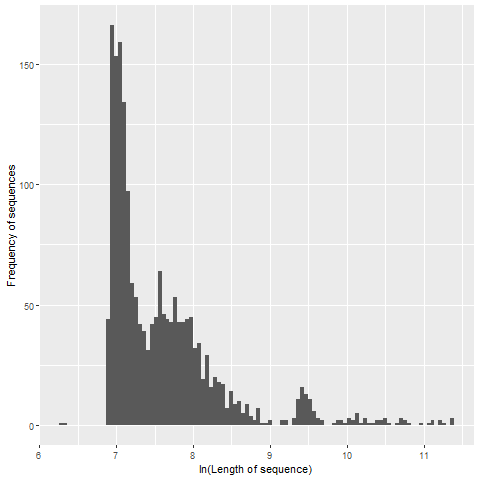
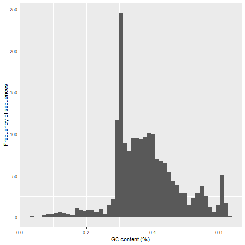
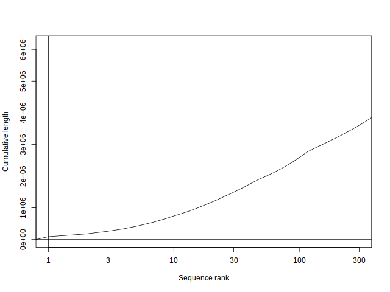
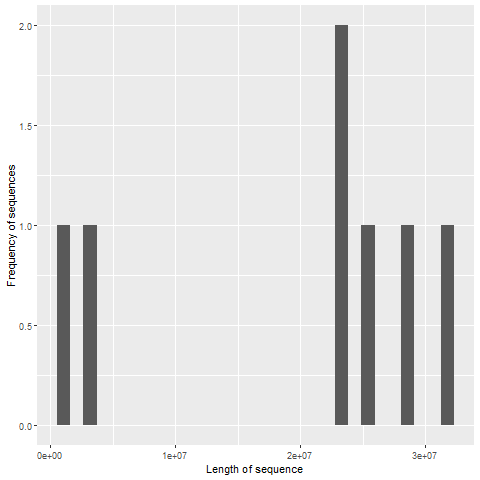
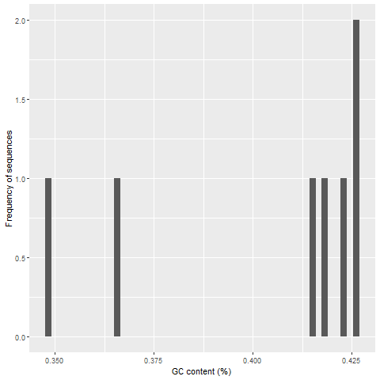
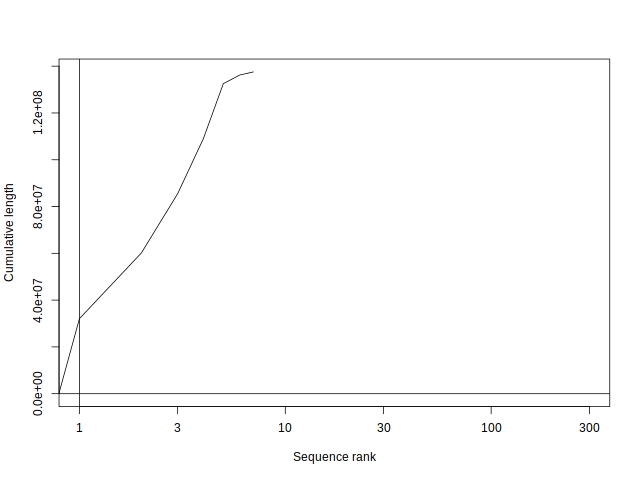
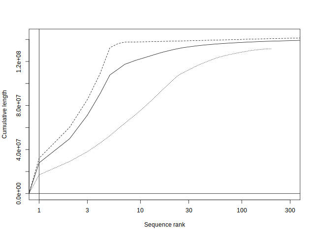
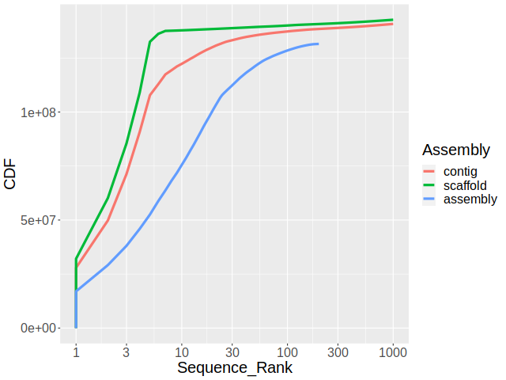

# HOMEWORK 4

Notes on the scripts:
1. Most of the activities were made using bash (_hw4_genome_summary.sh_ and _hw4_annotation_summary.sh_)
2. Only the plots #1 and #2 when were done with RStudio (_hw4_plots.sh) when summarizing partitions  

# A) SUMMARIZING PARTITIONS

Files with ≤ 100kb are named as _lt_ and > 100kb as _gt_.  
I made the partitions using faFilter, obtaining the files _lt.fa.gz_ and _gt.fa.gz_.  
To summarize the partitions I used faSize and obtained the next results:

## Answer for ≤ 100kb (_lt.fa.txt_ file):

1. Total number of nucleotides: 6178042 
2. Total number of Ns: 662593
3. Total number of sequences: 1863

## Answer for > 100kb (_gt.fa.txt_ file)

1. Total number of nucleotides: 137547960  
2. Total number of Ns: 490358
3. Total number of sequences: 7

# PLOTTING PARTITIONS

I obtained the files _lt.lgc.txt_ and _gt.lgcn.txt_ using bioawk and the _fa.gz_ files from each partition.  
Those _.txt_ files were exported and used in RStudio to get the plots #1 and #2 for each partition.
Then, the _.txt_ files were sorted and the resulting _lgcnsrt.txt_ files were used together with plotCDF  
to obtain the plot #3.  

## ≤ 100kb (lt)

1. Sequence length distribution.

2. Sequence GC% distribution.

3. Cumulative sorted

## > 100kb (gt)

1. Sequence length distribution.

2. Sequence GC% distribution.

3. Cumulative sorted

# B) ASSEMBLING A GENOME

## Assembling a genome

1. Dowloading the reads

`cp /pub/jje/ee282/iso1_onp_a2_1kb.fastq /data/homezvol2/echoreno/myrepos/ee282/`
`ln -sf iso1_onp_a2_1kb.fastq reads.fq`

2. Overlaping reads with minimap 

`minimap -t 32 -Sw5 -L100 -m0 reads.fq{,} \`
`| gzip -1 > onp.paf.gz`

3. Constructing an assembly

`miniasm -f reads.fq onp.paf.gz > reads.gfa`

## Assembly assesment
 
1. Calculating the N50 for the assembly.

Instead of creating a function, I made a pipeline to obtain the N50 step by step  
from the assembly (contained in the _reads.gfa_ file created previously).  
Then, I used fold to create the _unitigs.fa file_ used in the next activity.

N50 of the assembly= 4,494,246
N50 of Drosophila contig= 21,485,538

2. Comparing assembly to both the contig assembly and the scaffold assembly from the Drosophila melanogaster. 

I used both plotCDF and plotCDF2 to compare the assembly (_unitig_). _The file dmel-all-chromosome-r6.48.fasta.gz_ was  
considered as the scaffold assembly (_scaffold_). I used faSplotByN to obtain the contig assembly (_contig_) from the scaffold assembly.  
To compare the three assemblies I first obtained their sizes with bioawk and sort (_sizes.txt_ files when using plotCDF) and awk  
(_sizes_ files when using plotCDF2)    

### Using plotCDF 

### Using plotCDF2 

3. Calculating BUSCO scores

### For the assembly (using _unitig.fa_)

C:11.6%[S:11.6%,D:0.0%],F:4.9%,M:83.5%,n:3285    
380    Complete BUSCOs (C)                       
380    Complete and single-copy BUSCOs (S)       
0      Complete and duplicated BUSCOs (D)        
160    Fragmented BUSCOs (F)                     
2745   Missing BUSCOs (M)                        
3285   Total BUSCO groups searched   

### For D. melanogaster (using _dmel-all-chromosome-r6.48.fasta_)

C:98.7%[S:98.5%,D:0.2%],F:0.5%,M:0.8%,n:3285     
3243   Complete BUSCOs (C)                       
3235   Complete and single-copy BUSCOs (S)       
8      Complete and duplicated BUSCOs (D)        
16     Fragmented BUSCOs (F)                     
26     Missing BUSCOs (M)                        
3285   Total BUSCO groups searched   

